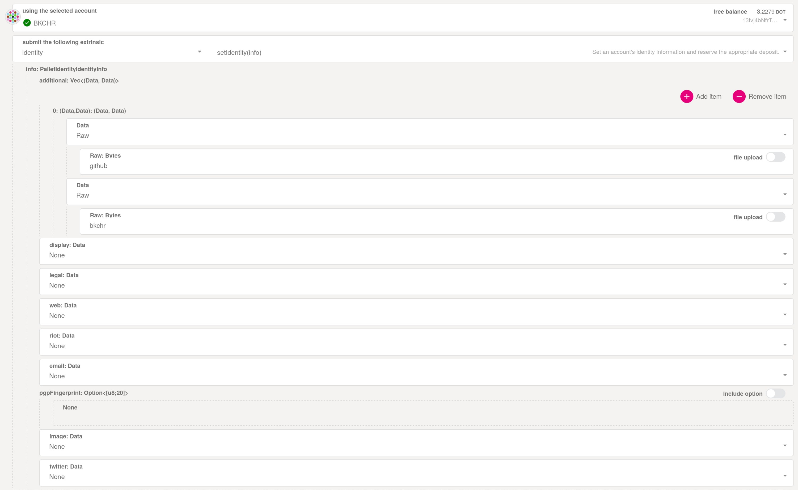

# Adding github account to your on-chain identity

Adding the github account to your identity requires the usage of the `additional` fields in the identity info. The identity needs to be set on Polkadot. This is currently only supported by using the [polkadot-js bare extrinsic interface](https://polkadot.js.org/apps/?rpc=wss%3A%2F%2Frpc.polkadot.io#/extrinsics/decode/0x1c010407676974687562123c67697468756220757365726e616d653e0000000000000000). See the following image for an example:

You should also at least add the `display` field. If you want to add `utf8` characters, you need to hex encode them and put the hex string (`0x` prefixed) into the field.

If you have other identity fields (`display`, `legal`, `email`, etc) already configured on-chain, you have to repeat them in this extrinsic (`None` values will override the existing information).
