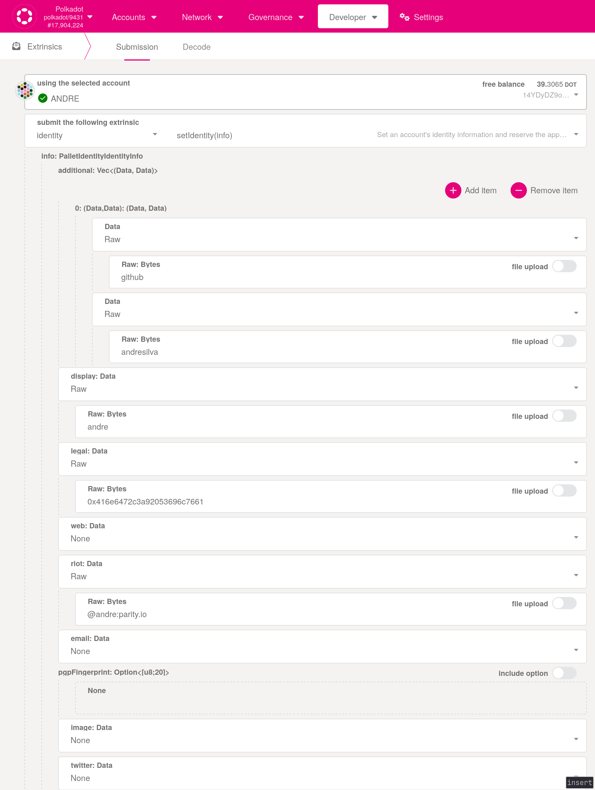

# Setting up on-chain identity

As a member of the Polkadot Technical Fellowship you should set an on-chain identity for your account on the Polkadot relay chain. Your identity should also include a field `github` pointing to your github username. Unfortunately this is a custom field that isn't supported by the polkadot.js UI, therefore in order to set it you'll need to create the identity extrinsic yourself.

In the polkadot.js UI go to `Developer > Extrinsics`. Select your fellowship member account and pick the extrinsic `identity.setIdentity`. Below is an example screenshot of what it should look like including the `github` field.

Keep in mind that when filling in the data with `Raw` type only ASCII is accepted, therefore if you need to use UTF-8 characters (e.g. diacritics or emojis), you should convert the data to hex beforehand. For example, my legal name is "André Silva", which I need to submit as `0x416e6472c3a92053696c7661`. You can use [this](https://onlinehextools.com/convert-utf8-to-hex) tool to do the conversion, just disable the options `Add Hex Base` and `Space Between Hex Values`, after the conversion you should prepend the result with a single `0x` and submit as `Raw`.

After submitting the extrinsic you won't be able to see the `github` field in the polkadot.js UI (custom fields aren't shown). You can confirm that everything was set correctly by checking the state (`Developer > Chain State > identity.identityOf`), or by using a block explorer like [Statescan](https://polkadot.statescan.io) which shows custom fields.

## Getting a judgment on your identity

After your identity is properly set you can get a judgment on it from one of the existing registrars. For instructions on how to get a judgment from the W3F registrar check [this](https://registrar.web3.foundation/) page which contains links to instructions. Due to the custom field in your identity the automated verification process won't work and you'll need to join the support channel on matrix to complete the verification.
