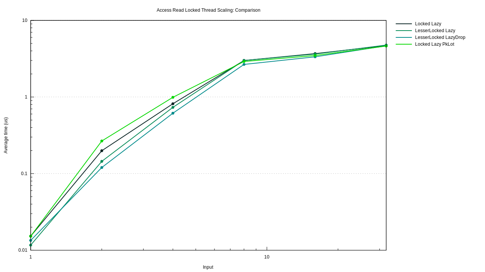

[](LICENSE-MIT)
[](LICENSE-APACHE)
[](https://docs.rs/static_init)
[](https://crates.io/crates/static_init)

Safe non const initialized statics and safe mutable statics with unbeatable performance.

Also provides code execution at program start-up/exit.

Why using non const initialized statics and safe mutable statics? Because all execution depends on state that is
maintained during all program execution. Because it is very difficult than it looks-like
to have an ergonomic, safe and with excellent performance solution for maintaining such state. 

# Feature

- [x] non const initialized statics.
- [x] statics dropped at program exit.
- [x] safe mutable lazy statics (locked).
- [x] every feature with `no_std` support.
- [x] unbeatable performance, can be order of magnitude faster that any other solution.
- [x] registration of code execution at program exit without allocation (as opposed to libc::at_exit).
- [x] ergonomic syntax.
- [x] sound and safe.
- [x] on nigtly, `thread_locals` and safe mutable `thread_locals`, guaranteed to be
    dropped at thread exit with the lowest possible overhead compared to
    what is provided by system library thread support or the standard library!

# Fastest Lazy Statics

This crate provides *lazy statics* on all platforms.

On unixes and windows *lesser lazy statics* are *lazy* during program startup phase
(before `main` is called). Once main is called, those statics are all guaranteed to be
initialized and any access to them almost no incur any performance cost

```
use static_init::{dynamic};

#[dynamic] 
static L1: Vec<i32> = vec![1,2,3,4,5,6];

#[dynamic(drop)] 
static mut L2: Vec<i32> = {let mut v = L1.clone(); v.push(43); v};
```

Those static initialization and access can be 10x faster than
what is provided by the standard library or other crates.

# Safe Mutable Statics

Just add the `mut` keyword to have mutable locked statics.

```
use static_init::{dynamic};

#[dynamic] 
static mut L1: Vec<i32> = vec![1,2,3,4,5,6];

//Mutable statics are safe to access
#[dynamic] 
static mut L2: Vec<i32> = {
   //get a unique lock:
   let mut lock = L1.write(); 
   lock.push(42); 
   lock.clone()
   };
```

Those statics use an *apdaptative phase locker* that gives them surprising performance.

# Classical Lazy statics 

By default, initialization of statics declared with the `dynamic` is forced before main
start on platform that support it. If *lazyness* if a required feature, the attribute argument
`lazy` can be used.

```rust
use static_init::{dynamic};

#[dynamic(lazy)] 
static L1: Vec<i32> = vec![1,2,3,4,5,6];

#[dynamic(lazy,drop)] 
static mut L3: Vec<i32> =L1.clone(); 
```

Even if the static is not mut, dropped statics are always locked. There is also a `finalize` attribute
argument that can be used to run a "drop" equivalent at program exit but leaves the static unchanged. 

Those lazy also provide superior performances compared to other solutions.

# Other features for lazy statics

In the documentation of macro `dynamic` you will find how to:

- declare static that are poisoned if first initialization panics. (By default initialization is retried)

- declare finalized or droped statics.

- declare droped or finalized statics that tolerate to be leaked.

- declare lazy statics that are also const initialized and provide a const fallback when their resource is released
  at program/thread exit

# `no_std` support

On linux or Reddox (TBC) this library is `no_std`. The library use directly the `futex` system call
to place thread in a wait queue when needed.

On other platform `no_std` support can be gain by using the `spin_loop` feature. NB that lock strategies
based on spin loop are not system-fair and cause entire system slow-down.

# Performant

## Under the hood

The statics and mutable statics declared with `dynamic` attribute use what we
call an  *adaptative phase locker*. This is a lock that is in between a `Once`
and a `RwLock`. It is carefully implemented as a variation over the `RwLock`
algorithms of `parking_lot` crate with other tradeoff and different
capabilities. 

It is qualified *adaptative* because the decision to take a read lock,
a write lock or not to take a lock is performed while the lock attempt is
performed and a thread may attempt to get a write lock but decides to be waked
as the owner of a read lock if it is about to be placed in a wait queue.

Statics and thread locals that need to register themselve for destruction at
program or thread exit are implemented as members of an intrusive list. This
implementation avoid heap memory allocation caused by system library support
(`libc::at_exit`, `glibc::__cxa_at_thread_exit`, pthread... registers use heap
memory allocation), and it avoid to fall on system library implementation
limits that may cause `thread_locals` declared with `std::thread_locals` not to
be dropped. 

Last but not least of the optimization, on windows and unixes (but not Mac yet)
`dynamic` statics initialization is forced before main start. This fact unable
a double check with a single boolean for all statics that is much faster other
double check solution. 

## Benchmark results

### Lazy static access

This graph showes the access time to lazy statics once they are initialized. The measurment includes statics from crates `double_checked_cell` and `lazy_static`.  In the legend "LesserLazy" are the lazy declared using `#[dynamic]` attribute and "Lazy" those declared with the
attribute `#[dynamic(lazy)]`. On the horizontal axis is reported the number of thread that almost simultaneous attempt to access the lazy and the vertical axis the access time summed over all thread. 

Access time to lazy from this crates can be up to *10x faster* than other solutions.


### Lazy static initialization

#### Extremely short initization performance

This graph showes the access time to lazy statics when the lazy is not yet
initialized. The measurment includes statics from crates `double_checked_cell`
and `lazy_static`.  In the legend "LesserLazy" are the lazy declared using
`#[dynamic]` attribute and "Lazy" those declared with the attribute
`#[dynamic(lazy)]`. On the horizontal axis is reported the number of thread
that almost simultaneous attempt to access and initialize the lazy and the
vertical axis the access time + initialization time overhead summed over all
thread. The initialization in itself count for pico seconds. "LesserLazy" (`#[dynamic]) are
not ploted here because they are initialized before main start but whatsoever,
they use the exact same lock as that of "Lazy" (`#[dynamic(lazy)]`) statics.

Initialization duration is *3x time faster* when using statics from this crates.


#### Large initization performance

In this case all thread attempt to initialize a static whose initialization takes
approximately 20µs. Static from this crates scale much better on high contention. On high contention
is this crates provides a *10x speed-up*.


### Mutable Locked lazy access

Mutable lazy from this crates are compared to an implementation using parking-lot crate `RwLock`. The implementation
can be found in the source file `benches/multi_threaded/main.rs`.

On the graph below the legend "Locked Lazy" are for mutable statics declared with `#[dynamic(lazy)]` attribute, "LesserLocked Lazy" those declared with `#[dynamic]`, "LesserLocked LazyDrop" those declared with `#[dynamic(drop)]` and "Locked Lazy PkLot" the one implemented using parking-lot crate `RwLock`.

Mutable locked statics from this crates are close to *2x time faster* than the solution using parking-lot RwLock if the initialization is attempted throught an attempt to get a read lock (on the first graph). When initilization is attempted through an attempt to get a write lock all solutions are globaly equivalent.




### Mutable locked lazy static initialization

#### Extremely short initization performance

Here we compare access time when the lazy is not yet initialized. On high
contention, when a high number of thread attempt to get a read lock while the
lazy is not yet initialized, lazy declared with #[dynamic(lazy)] perform close
to *100x time* `RwLock`. This is the concequence of the adaptative lock. On the
other hand, on low contention, when only 1 or 2 thread are simultaneously
attempting to initialize the static, this adaptative ness cause an increased
initialization time. Nevertheless this is a one shot performance shift of a few
nano seconds.


#### Large initialization time 

Here we compare access time + initialization time when the lazy is not yet initialized and when the initialization time is
of the order of 20µs. When all threads attempt to initialize the statics while trying to get a write lock, the statics from 
this crate hase similar performance as a static using parking_lot `RwLock`. But if such initialization is performed through attempt
to get a read lock, statics from this crate are *200x time faster* than `RwLock`. This is also a concequence of the adaptative lock algorithm.


# Thread local support

On nightly `thread_local` support can be enable with the feature
`thread_local`. The attribute `dynamic` can be used with thread locals as with
regular statics. In this case, the mutable `thread_local` will behave similarly
to a RefCell with the same syntax as mutable lazy statics.

```rust
# #![cfg_attr(feature = "thread_local", feature(thread_local))]
# use static_init::{Finaly,dynamic};
# #[cfg(feature = "thread_local")]
# mod m{
# use static_init::{dynamic};

#[dynamic(drop)] //guaranteed to be drop: no leak contrarily to std::thread_local
#[thread_local]
static V: Vec<i32> = vec![1,1,2,3,5];

#[dynamic]
#[thread_local]
static mut W: Vec<i32> = V.clone();
# fn main() { 
assert_ne!(W.read().len(), 0);
assert_ne!(W.try_read().unwrap().len(), 0);
# }
# }
```

# Unsafe Low level 

## Unchecked statics initiliazed at program start up

The library also provides unchecked statics, whose initialization is run before main start. Those statics
does not imply any memory overhead neither execution time overhead. This is the responsability of the coder
to be sure not to access those static before they are initialized.

```rust
use static_init::dynamic;

#[dynamic(10)]
static A: Vec<i32> = vec![1,2,3];

#[dynamic(0,drop)]
static mut B: Vec<i32> = unsafe {A.clone()};
```

Even if A is not declared mutable, the attribute macro convert it into a mutable static to ensure that every
access to it is unsafe.

The number indicates the priority, the larger the number, the sooner the static will be initialized.

Those statics can also be droped at program exit with the `drop` attribute argument.

## Program constructor destructor 

It is possible to register fonction for execution before main start/ after main returns.

```rust
use static_init::{constructor, destructor};

#[constructor(10)]
extern "C" fn run_first() {}

#[constructor(0)]
extern "C" fn then_run() {}

#[destructor(0)]
extern "C" fn pre_finish() {}

#[destructor(10)]
extern "C" fn finaly() {}
```

# Debug support

The feature `debug_order` can be activated to detect trouble with initialization order of raw
statics or dead locks due to lazy initialization depending on itself.
